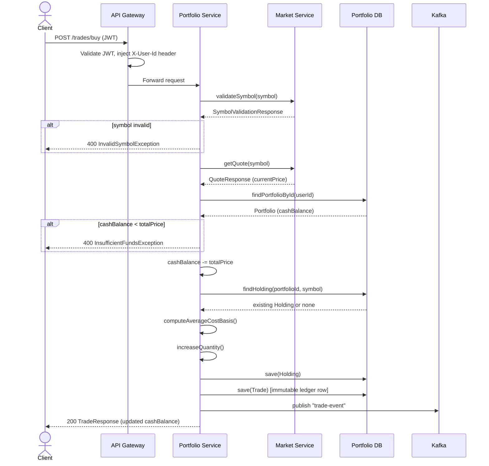
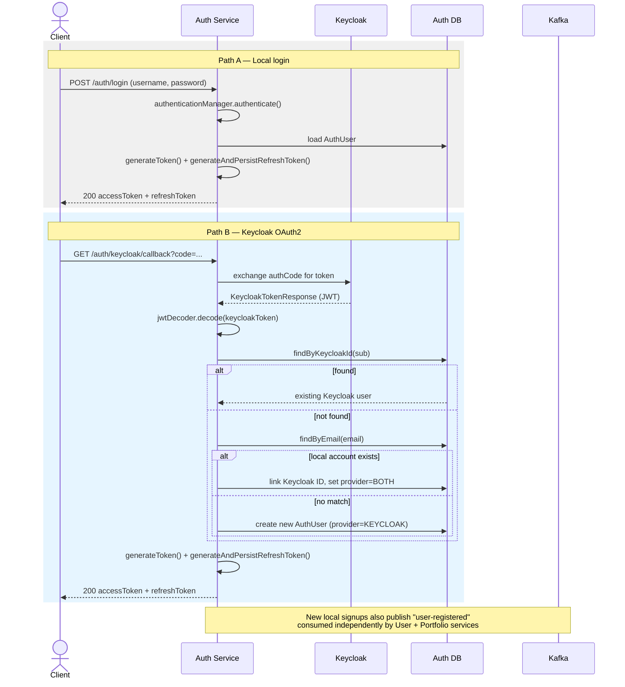

## Buy Trade Flow

```mermaid
sequenceDiagram
    actor Client
    participant GW as API Gateway
    participant PS as Portfolio Service
    participant MS as Market Service
    participant DB as Portfolio DB
    participant Kafka

    Client->>GW: POST /trades/buy (JWT)
    GW->>GW: Validate JWT, inject X-User-Id header
    GW->>PS: Forward request

    PS->>MS: validateSymbol(symbol)
    MS-->>PS: SymbolValidationResponse

    alt symbol invalid
        PS-->>Client: 400 InvalidSymbolException
    end

    PS->>MS: getQuote(symbol)
    MS-->>PS: QuoteResponse (currentPrice)

    PS->>DB: findPortfolioById(userId)
    DB-->>PS: Portfolio (cashBalance)

    alt cashBalance < totalPrice
        PS-->>Client: 400 InsufficientFundsException
    end

    PS->>PS: cashBalance -= totalPrice
    PS->>DB: findHolding(portfolioId, symbol)
    DB-->>PS: existing Holding or none

    PS->>PS: computeAverageCostBasis()
    PS->>PS: increaseQuantity()
    PS->>DB: save(Holding)

    PS->>DB: save(Trade) [immutable ledger row]
    PS->>Kafka: publish "trade-event"

    PS-->>Client: 200 TradeResponse (updated cashBalance)
```

## Dual-Path Auth Flow

```mermaid
sequenceDiagram
    actor Client
    participant Auth as Auth Service
    participant KC as Keycloak
    participant DB as Auth DB
    participant Kafka

    rect rgb(240, 240, 240)
    note over Client,DB: Path A — Local login
    Client->>Auth: POST /auth/login (username, password)
    Auth->>Auth: authenticationManager.authenticate()
    Auth->>DB: load AuthUser
    Auth->>Auth: generateToken() + generateAndPersistRefreshToken()
    Auth-->>Client: 200 accessToken + refreshToken
    end

    rect rgb(230, 245, 255)
    note over Client,DB: Path B — Keycloak OAuth2
    Client->>Auth: GET /auth/keycloak/callback?code=...
    Auth->>KC: exchange authCode for token
    KC-->>Auth: KeycloakTokenResponse (JWT)
    Auth->>Auth: jwtDecoder.decode(keycloakToken)

    Auth->>DB: findByKeycloakId(sub)
    alt found
        DB-->>Auth: existing Keycloak user
    else not found
        Auth->>DB: findByEmail(email)
        alt local account exists
            Auth->>DB: link Keycloak ID, set provider=BOTH
        else no match
            Auth->>DB: create new AuthUser (provider=KEYCLOAK)
        end
    end

    Auth->>Auth: generateToken() + generateAndPersistRefreshToken()
    Auth-->>Client: 200 accessToken + refreshToken
    end

    note over Auth,Kafka: New local signups also publish "user-registered"<br/>consumed independently by User + Portfolio services
```
