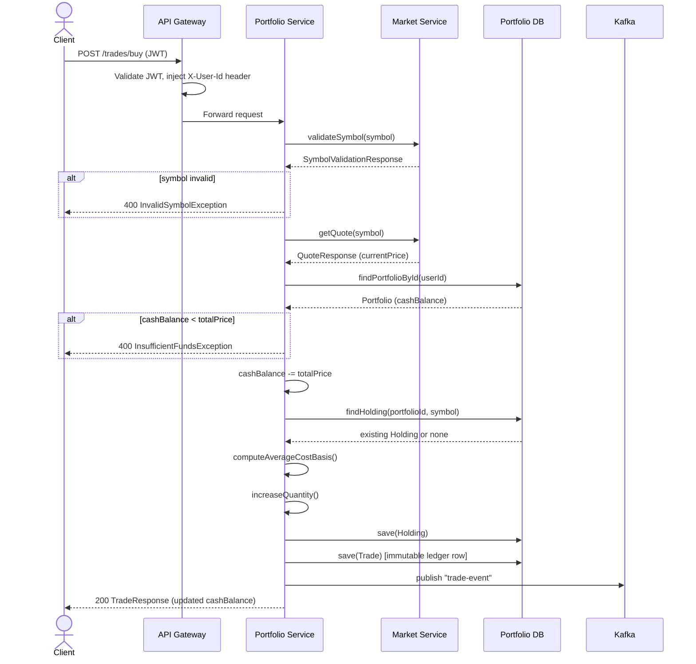
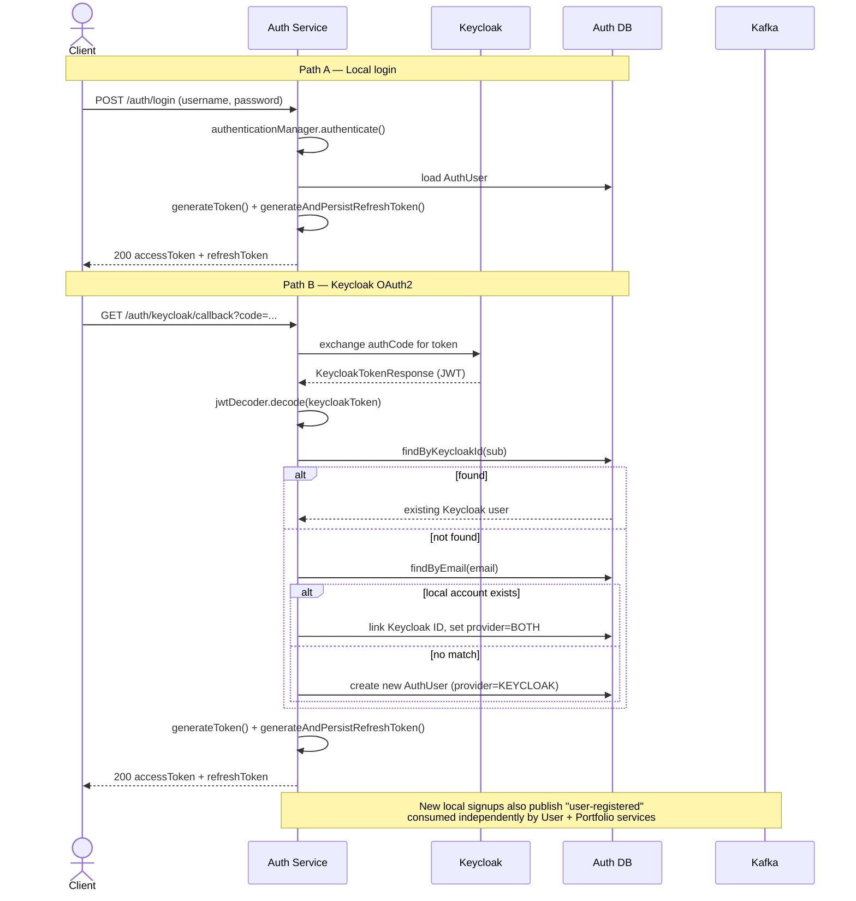
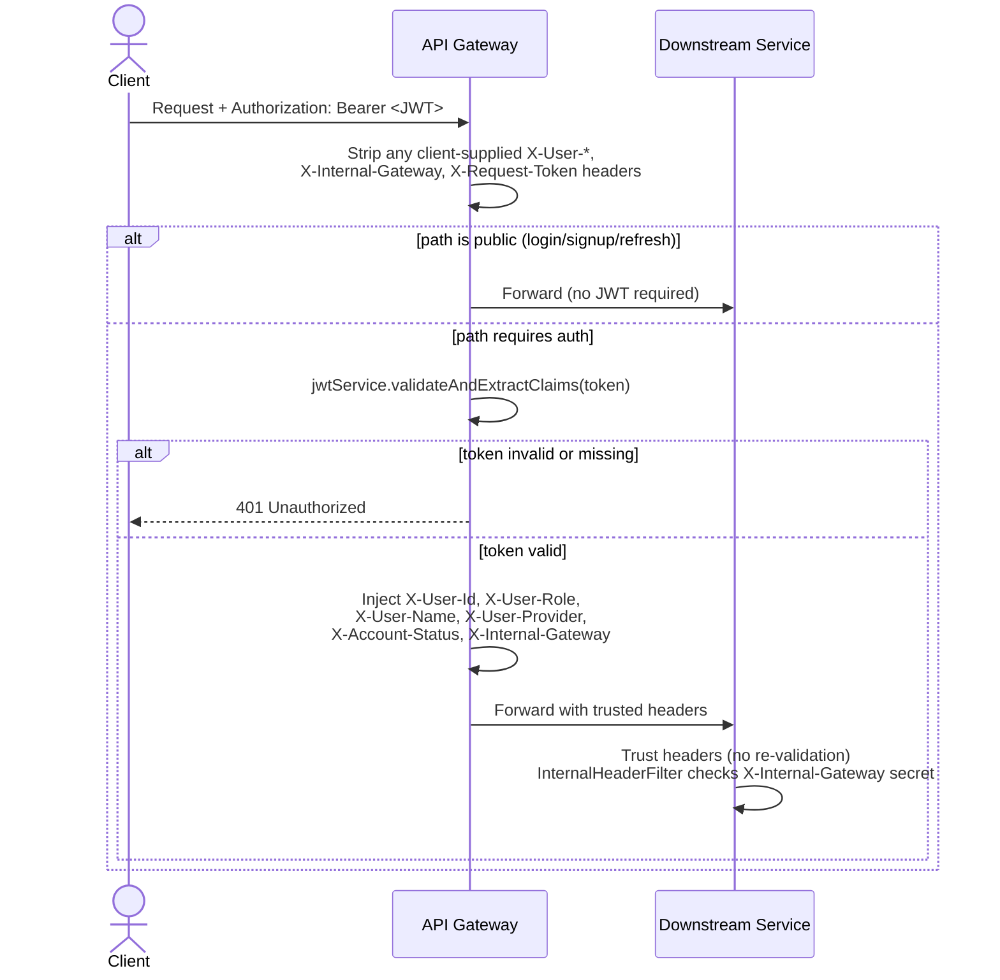
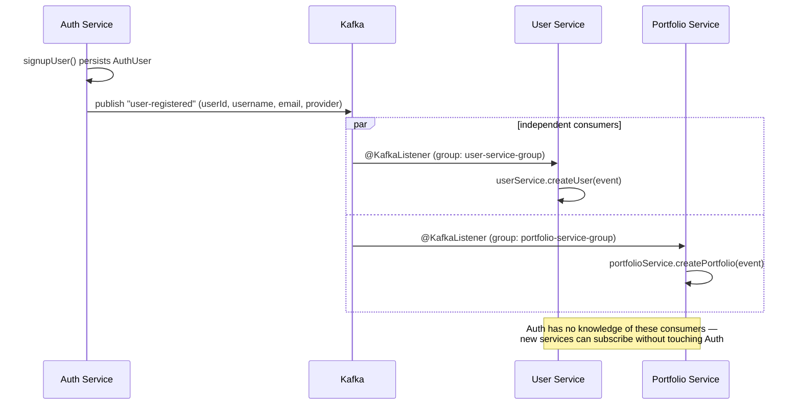

Welcome to TradeHub

This is a microservices based project that takes the context of a paper trading web app to demonstrate some aspects of real world design 

HLD:

-- Leave the space for image and any other introduction

Services:
-- Small introduction about the various Services

Control Flows:

## Buy Trade Flow

## Dual-Path Auth Flow

## Gateway Zero-Trust Header Flow

## Kafka Fan-Out on User Registration

Design Decisions
# TradeHub — Architecture Notes

## Key Design Decisions

**Dual authentication with a single token issuer.** TradeHub supports both local username/password auth and Keycloak OAuth login, but all downstream services only ever see one token format. The Auth Service acts as the single JWT issuer — for local logins it verifies credentials and mints a JWT directly; for Keycloak logins it validates the Keycloak token via JWKS, performs JIT provisioning, and exchanges it for an identically shaped internal JWT. This means zero divergence in how Portfolio, Market, or any other service handles authentication regardless of how the user originally signed up.

**Gateway as the sole trust boundary.** All external traffic flows through Spring Cloud Gateway on port 8080. The gateway validates the JWT, strips any client-supplied internal headers, injects verified identity headers (`X-User-Id`, `X-User-Role`, `X-Account-Status`, `X-Internal-Gateway`), and forwards to the appropriate service. Downstream services trust only requests carrying the internal gateway secret — they never re-validate JWTs and never hit the Auth DB to resolve identity. This removes per-service authentication overhead and keeps authorization logic in one place.

**Auth Service owns authentication state; User Service owns profile data.** Account status (`ACTIVE`, `SUSPENDED`) lives in Auth Service and travels in the JWT. User Service stores only profile-level data — username, email, full name, auth provider. Role assignment and suspension are Auth Service concerns exclusively. This prevents the dual-ownership problem where two services disagree on whether a user can log in.

**Refresh token rotation with hashed storage.** Refresh tokens are random UUIDs stored as SHA-256 hashes — the raw token is sent to the client, the hash lives in the DB. On every refresh call the old token is revoked and a new pair is issued. A stolen refresh token is single-use before invalidation.

**JIT provisioning for Keycloak users.** The first time a Keycloak-authenticated user hits the `/keycloak/exchange` endpoint, Auth Service extracts their `sub` claim and email, creates a local `auth_users` row with `ROLE_USER` and `ACTIVE` status, then mints an internal JWT. Subsequent logins skip creation and go straight to token minting. User Service receives a `UserRegisteredEvent` over Kafka regardless of auth path — the provisioning trigger is always Kafka, never a direct call.

**Portfolio entities as separate aggregate roots.** Portfolio, Holding, and Trade are three distinct JPA entities with no ORM-managed relationships between them. Cross-aggregate references are bare UUID columns, not `@ManyToOne` / `@OneToMany` mappings. This eliminates accidental cascade operations, N+1 loading surprises, and transaction scope bleed between aggregates. Each repository owns exactly one table.

**Derived portfolio value is never persisted.** `totalWorth` = cash balance + (sum of holdings × live prices) is computed on read, never stored. Storing it would require updating every affected user's Portfolio row on every market price tick — an O(users × holdings) write problem on every quote update. The computation is cheap at read time given live prices are already cached in Redis.

**Market data with provider fallback and cache.** Finnhub is the primary quote source. On circuit breaker open or rate limit hit, the service falls back to Alpha Vantage. Both providers have independent Resilience4j rate limiters reflecting their respective free-tier limits. Redis caches quotes with a 15-second TTL — stale cache is the last resort if both providers are unavailable.

---

## Engineering Challenges

**AuthenticationManager circular proxy in Spring Boot 4.** Exposing `AuthenticationManager` as a `@Bean` from the same `SecurityConfig` that builds the `SecurityFilterChain` creates an AOP proxy that delegates back to itself, producing a `StackOverflowError` at runtime. The fix is separating the `AuthenticationManager` bean into its own configuration class so it has no involvement in building the filter chain.

**JWT filter running on public endpoints.** Spring Security's `permitAll()` controls authorization, not filter execution. A custom `OncePerRequestFilter` registered via `addFilterBefore` runs on every request regardless of path rules. Public endpoints like `/auth/login` were hitting the internal header check and returning 403. Resolved by overriding `shouldNotFilter()` to return early for whitelisted paths.

**Redis deserialization with Jackson 3.** Spring Boot 4 ships with Jackson 3, which relocated packages from `com.fasterxml.jackson` to `tools.jackson`. `GenericJacksonJsonRedisSerializer` without explicit type information deserializes cached objects as `LinkedHashMap` rather than the target DTO, throwing `IllegalStateException` on cache retrieval. Resolved using `Jackson2JsonRedisSerializer<QuoteResponse>` with an explicit type parameter, eliminating the need for default typing or `@class` metadata in the stored JSON.

**Gateway not forwarding internal secret to public routes.** The internal secret header was added only inside the JWT validation block, which public paths bypassed entirely. Services receiving public-route requests had no `X-Internal-Gateway` header and returned 403. Fixed by sanitizing and injecting the secret on all requests before the public path short-circuit, so every forwarded request carries the header regardless of whether it required JWT validation.

**Kafka event schema divergence across services.** Auth Service publishes `UserRegisteredEvent` with `authProvider` as a field. User Service needs `authProvider` for profile data. Portfolio Service needs only `userId`, `username`, and `email` to seed a new portfolio. Sharing a single event class across services via a common module would couple them to Auth Service's domain enums. Each service defines its own local version of the event record with only the fields it cares about — Jackson ignores unknown fields during deserialization by default, so the payload is forwards and backwards compatible without coordination.

**Refresh token as a record.** Java records are fully immutable — a `revoked` flag on a refresh token record cannot be flipped after creation because there are no setters and `updatable = false` would prevent JPA from writing the change anyway. Refresh tokens must be mutable entities to support revocation, so a regular class with Lombok is the correct model despite records being idiomatic for other DTOs in the project.

---

## Engineering Trade-offs

**Internal header secret vs network isolation.** The `X-Internal-Gateway` shared secret provides application-layer service authentication without infrastructure changes. The real-world approach is VPC subnet isolation (services unreachable externally) combined with mTLS for encrypted service-to-service traffic. The header approach is a deliberate simplification: the secret is static, rotation requires a coordinated redeploy of all services, and a compromised secret allows direct service access from inside the network. Documented here as a known limitation rather than an oversight.

**HS256 vs RS256 for JWT signing.** HMAC-SHA256 requires the same secret on every service that validates tokens. In this architecture that means the gateway and every microservice share one secret, widening the attack surface with each service added. RS256 with asymmetric keys would let Auth Service hold the private key exclusively while all verifiers use the public key — free to distribute, no shared secret risk. HS256 was chosen for implementation simplicity; the migration path to RS256 requires only a key generation step and a config update per service.

**Local DAO auth alongside Keycloak.** Running two auth paths means two sources of credential management, two sets of signup/login code, and the complexity of ensuring both paths produce identical JWT claims. The production pattern is to configure Keycloak as the single front door and run username/password auth inside Keycloak's own user store rather than building it separately. The dual-path approach was retained to demonstrate hand-rolled JWT auth as a portfolio artifact, with this trade-off explicitly acknowledged.

**Soft delete via `deletedAt` timestamp vs a boolean flag.** A `deletedAt` timestamp column is marginally more expensive to index and query against than a boolean `isDeleted` flag but captures when deletion occurred — necessary for GDPR data retention schedules, audit trails, and purge jobs that hard-delete records older than a retention window. `@SQLRestriction("deleted_at IS NULL")` on the entity makes the filter transparent to all queries without adding a `WHERE` clause manually everywhere.

**Bare UUID FK columns vs JPA-managed relationships across aggregates.** ORM-managed `@ManyToOne` / `@OneToMany` relationships across Portfolio, Holding, and Trade would simplify some query patterns but introduce cascade risks, lazy-loading surprises, and transaction scope coupling between entities that should be independently mutable. A trade execution touches Holding (update quantity and cost basis), Portfolio (update cash balance), and Trade (append new row) — three separate writes that should each be explicit, not triggered implicitly by cascade. Bare UUID columns keep aggregate boundaries honest at the cost of slightly more verbose repository queries.

**Redis quote cache TTL of 15 seconds.** A longer TTL reduces Finnhub API calls and improves latency but serves increasingly stale prices — a material problem for paper trading where execution price is the whole point. A shorter TTL increases API call frequency, raising the risk of hitting free-tier rate limits during market hours. 15 seconds is a compromise: stale enough to be cache-effective, fresh enough that the displayed price isn't misleading for a paper trading context.

Database-per-service, chosen deliberately by data shape. Each service owns its own schema — Auth and User each get their own Postgres database, Portfolio gets Postgres for transactional consistency (cash + holdings + trades must commit atomically), and Market Service holds no persistent database at all, using Redis purely as an ephemeral cache layer.

Auth and User identity are split, not merged. Auth Service owns credentials, JWT issuance, and OAuth2/Keycloak integration. User Service owns profile data only. This keeps credential-handling logic isolated to one security boundary and lets every other service consume identity via Kafka events instead of duplicating auth logic.

One JWT format regardless of login method. Both local username/password login and Keycloak OIDC login are normalized into a single self-issued JWT shape by Auth Service. Every downstream service reads one consistent claim structure (userId, role) regardless of how the user originally authenticated.

Gateway-centric trust model (zero-trust internal architecture). Spring Cloud Gateway is the sole JWT verification point. It extracts identity claims and forwards them as headers (X-User-Id, X-User-Role) alongside a shared secret header, so downstream services never re-parse or re-verify JWTs — they trust Gateway-forwarded headers exclusively, validated by a per-service internal filter checking the shared secret.

Event-driven fan-out for cross-service consistency. A single user-registered Kafka event, published once by Auth Service, is independently consumed by User Service (profile creation) and Portfolio Service (seeding a virtual $100,000 cash balance) — one producer, multiple independent consumers, no direct service-to-service coupling for onboarding.

Derived financial data is never persisted as a stored field. Portfolio total worth (cash + live holding value) is computed on-read at request time by calling Market Service for current prices, rather than stored and incrementally updated — avoiding the correctness burden of keeping a derived value in sync with every price tick.

Dual-provider market data with automatic failover. Finnhub is the primary quote provider; Alpha Vantage is a Resilience4j circuit-breaker fallback, invoked only when Finnhub's circuit opens — not exposed as an independently callable endpoint, preserving its limited daily quota.

Engineering Challenges

Spring Boot / Spring Cloud version incompatibility. Initial Gateway setup on Spring Boot 4.1.0 with Spring Cloud 2025.1.2 resulted in routes silently failing to register (New routes count: 0) despite correct YAML configuration confirmed via Config Server. Root-caused to an immature artifact (spring-cloud-starter-gateway-server-webflux) in a not-yet-stable Boot/Cloud pairing; resolved by standardizing all services on Spring Boot 3.3.5 with Spring Cloud 2023.0.3.

Correctly sequencing weighted-average cost basis calculation. Updating a Holding's average cost basis on repeated buys requires computing the weighted average before mutating the stored quantity — reversing this order silently corrupts the calculation without throwing any error, since the bug produces a plausible-looking but incorrect number rather than a crash.

Distinguishing service identity from user identity in inter-service calls. Forwarding X-User-Id/X-User-Role headers between services (e.g. Portfolio calling Market Service) initially conflated "this call is authorized" with "this user identity claim is trustworthy" — a compromised or buggy internal service could otherwise forge arbitrary user context. Resolved by auditing each downstream service's actual attack surface: Market Service performs no user-scoped mutations, so forwarded identity headers carry no exploitable risk there, while Portfolio Service — the one service with financial mutations — only ever receives identity headers directly from Gateway, never from peer-service calls.

Kafka consumer idempotency under redelivery. Designing every Kafka consumer (User Service, Portfolio Service, and later Audit/Analytics) to safely handle at-least-once delivery semantics — a redelivered user-registered event must not create duplicate profile or portfolio rows, enforced via existence checks backed by unique DB constraints.

AuthenticationManager circular proxy in Spring Boot 4. Exposing AuthenticationManager as a @Bean from the same SecurityConfig that builds the SecurityFilterChain creates an AOP proxy that delegates back to itself, producing a StackOverflowError at runtime. The fix is separating the AuthenticationManager bean into its own configuration class so it has no involvement in building the filter chain.

JWT filter running on public endpoints. Spring Security's permitAll() controls authorization, not filter execution. A custom OncePerRequestFilter registered via addFilterBefore runs on every request regardless of path rules. Public endpoints like /auth/login were hitting the internal header check and returning 403. Resolved by overriding shouldNotFilter() to return early for whitelisted paths.

Redis deserialization with Jackson 3. Spring Boot 4 ships with Jackson 3, which relocated packages from com.fasterxml.jackson to tools.jackson. GenericJacksonJsonRedisSerializer without explicit type information deserializes cached objects as LinkedHashMap rather than the target DTO, throwing IllegalStateException on cache retrieval. Resolved using Jackson2JsonRedisSerializer<QuoteResponse> with an explicit type parameter, eliminating the need for default typing or @class metadata in the stored JSON.

Gateway not forwarding internal secret to public routes. The internal secret header was added only inside the JWT validation block, which public paths bypassed entirely. Services receiving public-route requests had no X-Internal-Gateway header and returned 403. Fixed by sanitizing and injecting the secret on all requests before the public path short-circuit, so every forwarded request carries the header regardless of whether it required JWT validation.

Kafka event schema divergence across services. Auth Service publishes UserRegisteredEvent with authProvider as a field. User Service needs authProvider for profile data. Portfolio Service needs only userId, username, and email to seed a new portfolio. Sharing a single event class across services via a common module would couple them to Auth Service's domain enums. Each service defines its own local version of the event record with only the fields it cares about — Jackson ignores unknown fields during deserialization by default, so the payload is forwards and backwards compatible without coordination.

Refresh token as a record. Java records are fully immutable — a revoked flag on a refresh token record cannot be flipped after creation because there are no setters and updatable = false would prevent JPA from writing the change anyway. Refresh tokens must be mutable entities to support revocation, so a regular class with Lombok is the correct model despite records being idiomatic for other DTOs in the project.

Engineering Tradeoffs

BigDecimal over primitive numeric types for all monetary and share-quantity fields, accepting the verbosity cost in exchange for eliminating floating-point rounding error accumulation across repeated trades — a standard requirement for any system modeling money.

Optimistic locking (@Version) over pessimistic row locking on the Portfolio entity, trading a small chance of retry-on-conflict for significantly better read throughput under normal (low-contention) load, appropriate for a single-user-per-portfolio access pattern.

Fractional share support was chosen over integer-only quantities, adding BigDecimal precision-handling complexity throughout the trade execution path in exchange for closer alignment with real-world brokerage behavior.

Denormalizing username/email into User Service rather than querying Auth Service at read time, accepting minor data duplication and eventual-consistency risk (a username change in Auth Service requires a follow-up sync event) in exchange for removing a synchronous cross-service dependency from every profile read.

A shared internal-secret header (rather than mTLS or per-service OAuth2 client credentials) authenticates Gateway-to-service calls, chosen for implementation speed within project scope; documented as the production-grade gap, with mTLS or OAuth2 client-credentials identified as the correct next step for genuine service-identity verification.

OTP-based two-factor authentication was scoped out after evaluating implementation cost against project timeline, in favor of a two-method authentication model (local credentials + Keycloak OIDC) that still demonstrates dual-provider identity handling and JWT normalization.

Internal header secret vs network isolation. The X-Internal-Gateway shared secret provides application-layer service authentication without infrastructure changes. The real-world approach is VPC subnet isolation (services unreachable externally) combined with mTLS for encrypted service-to-service traffic. The header approach is a deliberate simplification: the secret is static, rotation requires a coordinated redeploy of all services, and a compromised secret allows direct service access from inside the network. Documented here as a known limitation rather than an oversight.

HS256 vs RS256 for JWT signing. HMAC-SHA256 requires the same secret on every service that validates tokens. In this architecture that means the gateway and every microservice share one secret, widening the attack surface with each service added. RS256 with asymmetric keys would let Auth Service hold the private key exclusively while all verifiers use the public key — free to distribute, no shared secret risk. HS256 was chosen for implementation simplicity; the migration path to RS256 requires only a key generation step and a config update per service.

Local DAO auth alongside Keycloak. Running two auth paths means two sources of credential management, two sets of signup/login code, and the complexity of ensuring both paths produce identical JWT claims. The production pattern is to configure Keycloak as the single front door and run username/password auth inside Keycloak's own user store rather than building it separately. The dual-path approach was retained to demonstrate hand-rolled JWT auth as a portfolio artifact, with this trade-off explicitly acknowledged.

Soft delete via deletedAt timestamp vs a boolean flag. A deletedAt timestamp column is marginally more expensive to index and query against than a boolean isDeleted flag but captures when deletion occurred — necessary for GDPR data retention schedules, audit trails, and purge jobs that hard-delete records older than a retention window. @SQLRestriction("deleted_at IS NULL") on the entity makes the filter transparent to all queries without adding a WHERE clause manually everywhere.

Bare UUID FK columns vs JPA-managed relationships across aggregates. ORM-managed @ManyToOne / @OneToMany relationships across Portfolio, Holding, and Trade would simplify some query patterns but introduce cascade risks, lazy-loading surprises, and transaction scope coupling between entities that should be independently mutable. A trade execution touches Holding (update quantity and cost basis), Portfolio (update cash balance), and Trade (append new row) — three separate writes that should each be explicit, not triggered implicitly by cascade. Bare UUID columns keep aggregate boundaries honest at the cost of slightly more verbose repository queries.

Redis quote cache TTL of 15 seconds. A longer TTL reduces Finnhub API calls and improves latency but serves increasingly stale prices — a material problem for paper trading where execution price is the whole point. A shorter TTL increases API call frequency, raising the risk of hitting free-tier rate limits during market hours. 15 seconds is a compromise: stale enough to be cache-effective, fresh enough that the displayed price isn't misleading for a paper trading context.
