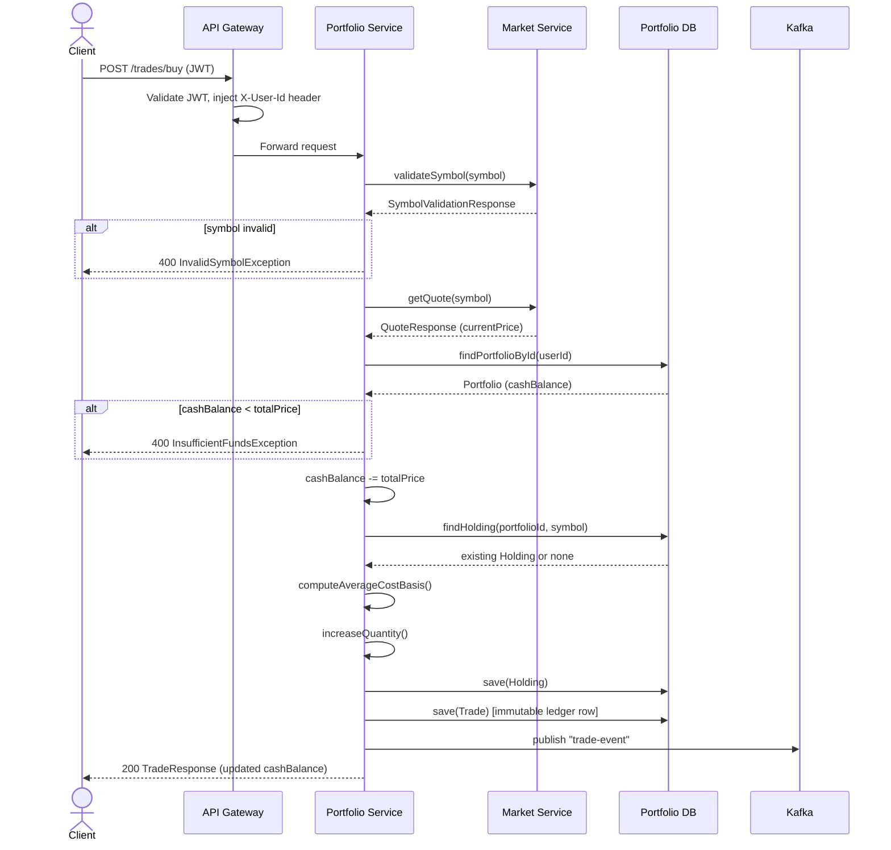
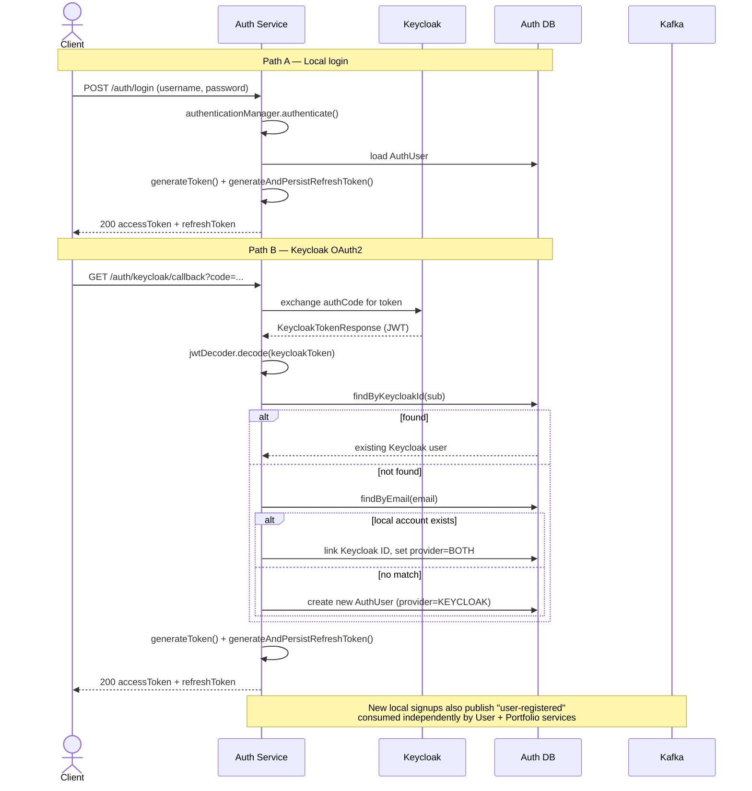
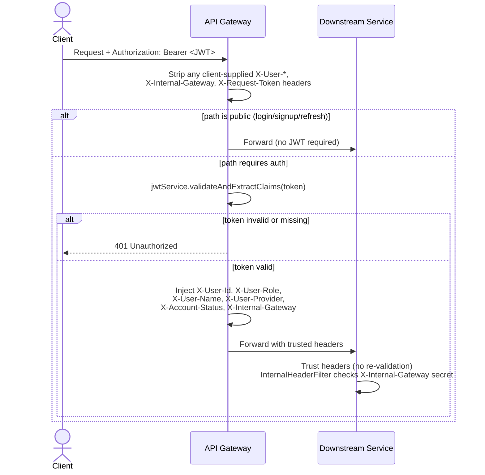
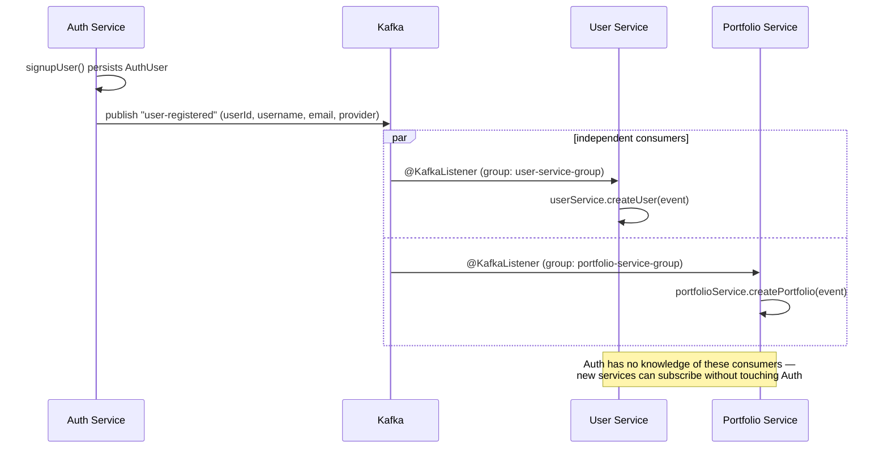

## Buy Trade Flow

```mermaid
sequenceDiagram
    actor Client
    participant GW as API Gateway
    participant PS as Portfolio Service
    participant MS as Market Service
    participant DB as Portfolio DB
    participant Kafka

    Client->>GW: POST /trades/buy (JWT)
    GW->>GW: Validate JWT, inject X-User-Id header
    GW->>PS: Forward request

    PS->>MS: validateSymbol(symbol)
    MS-->>PS: SymbolValidationResponse

    alt symbol invalid
        PS-->>Client: 400 InvalidSymbolException
    end

    PS->>MS: getQuote(symbol)
    MS-->>PS: QuoteResponse (currentPrice)

    PS->>DB: findPortfolioById(userId)
    DB-->>PS: Portfolio (cashBalance)

    alt cashBalance < totalPrice
        PS-->>Client: 400 InsufficientFundsException
    end

    PS->>PS: cashBalance -= totalPrice
    PS->>DB: findHolding(portfolioId, symbol)
    DB-->>PS: existing Holding or none

    PS->>PS: computeAverageCostBasis()
    PS->>PS: increaseQuantity()
    PS->>DB: save(Holding)

    PS->>DB: save(Trade) [immutable ledger row]
    PS->>Kafka: publish "trade-event"

    PS-->>Client: 200 TradeResponse (updated cashBalance)
```

## Dual-Path Auth Flow

```mermaid
sequenceDiagram
    actor Client
    participant Auth as Auth Service
    participant KC as Keycloak
    participant DB as Auth DB
    participant Kafka

    note over Client,DB: Path A — Local login
    Client->>Auth: POST /auth/login (username, password)
    Auth->>Auth: authenticationManager.authenticate()
    Auth->>DB: load AuthUser
    Auth->>Auth: generateToken() + generateAndPersistRefreshToken()
    Auth-->>Client: 200 accessToken + refreshToken

    note over Client,DB: Path B — Keycloak OAuth2
    Client->>Auth: GET /auth/keycloak/callback?code=...
    Auth->>KC: exchange authCode for token
    KC-->>Auth: KeycloakTokenResponse (JWT)
    Auth->>Auth: jwtDecoder.decode(keycloakToken)

    Auth->>DB: findByKeycloakId(sub)
    alt found
        DB-->>Auth: existing Keycloak user
    else not found
        Auth->>DB: findByEmail(email)
        alt local account exists
            Auth->>DB: link Keycloak ID, set provider=BOTH
        else no match
            Auth->>DB: create new AuthUser (provider=KEYCLOAK)
        end
    end

    Auth->>Auth: generateToken() + generateAndPersistRefreshToken()
    Auth-->>Client: 200 accessToken + refreshToken

    note over Auth,Kafka: New local signups also publish "user-registered"<br/>consumed independently by User + Portfolio services
```

## Gateway Zero-Trust Header Flow

```mermaid
sequenceDiagram
    actor Client
    participant GW as API Gateway
    participant Auth as Downstream Service

    Client->>GW: Request + Authorization: Bearer <JWT>

    GW->>GW: Strip any client-supplied X-User-*,<br/>X-Internal-Gateway, X-Request-Token headers

    alt path is public (login/signup/refresh)
        GW->>Auth: Forward (no JWT required)
    else path requires auth
        GW->>GW: jwtService.validateAndExtractClaims(token)
        alt token invalid or missing
            GW-->>Client: 401 Unauthorized
        else token valid
            GW->>GW: Inject X-User-Id, X-User-Role,<br/>X-User-Name, X-User-Provider,<br/>X-Account-Status, X-Internal-Gateway
            GW->>Auth: Forward with trusted headers
            Auth->>Auth: Trust headers (no re-validation)<br/>InternalHeaderFilter checks X-Internal-Gateway secret
        end
    end
```

## Kafka Fan-Out on User Registration

```mermaid
sequenceDiagram
    participant Auth as Auth Service
    participant Kafka
    participant User as User Service
    participant Portfolio as Portfolio Service

    Auth->>Auth: signupUser() persists AuthUser
    Auth->>Kafka: publish "user-registered" (userId, username, email, provider)

    par independent consumers
        Kafka->>User: @KafkaListener (group: user-service-group)
        User->>User: userService.createUser(event)
    and
        Kafka->>Portfolio: @KafkaListener (group: portfolio-service-group)
        Portfolio->>Portfolio: portfolioService.createPortfolio(event)
    end

    note over User,Portfolio: Auth has no knowledge of these consumers —<br/>new services can subscribe without touching Auth
```

