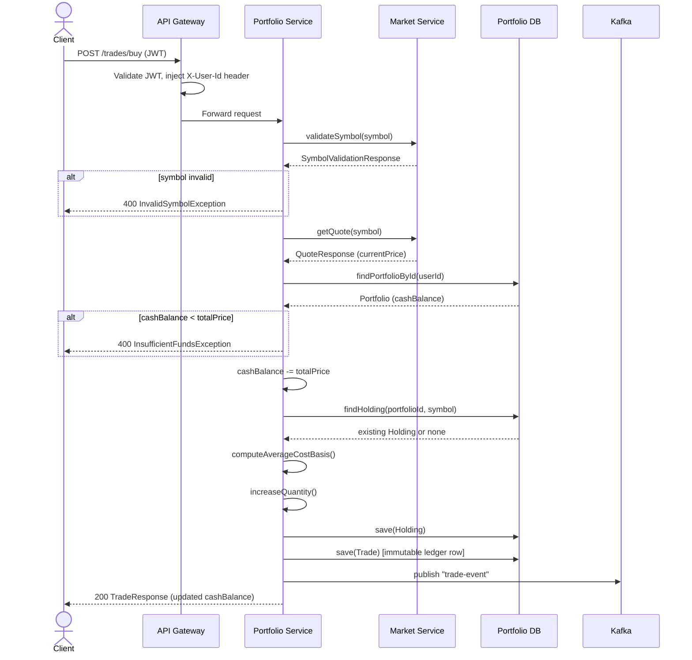
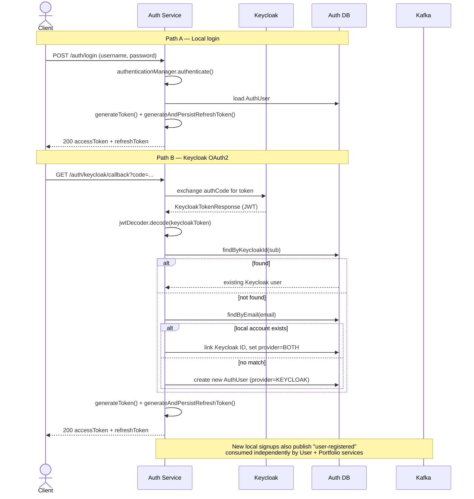
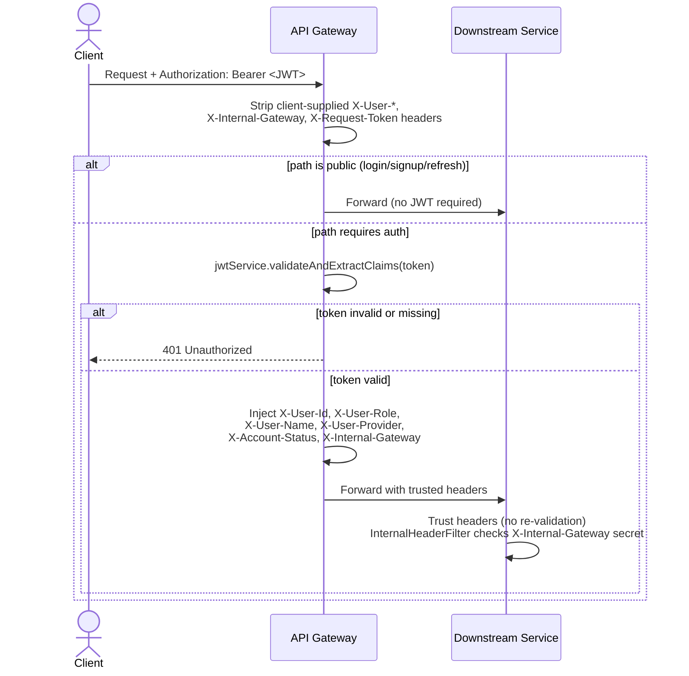
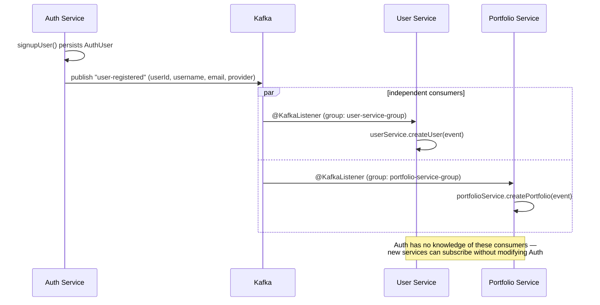

# TradeHub

TradeHub is a **microservices-based paper trading platform** built to explore real-world backend architecture, distributed systems, service boundaries, event-driven communication, resilience, authentication, and data consistency.

The application domain is intentionally simple: users can manage virtual portfolios and execute paper trades using market data.

The engineering problems are the focus.

---

## Architecture

### High-Level Design


---

## Service Overview

| Component | Responsibility |
|---|---|
| **API Gateway** | Single entry point for external traffic, JWT validation, identity propagation, and request routing |
| **Auth Service** | Local authentication, JWT issuance, refresh-token management, Keycloak OAuth2 integration, and account state |
| **User Service** | Stores and manages user profile information |
| **Portfolio Service** | Handles portfolios, holdings, trade execution, and portfolio state |
| **Market Service** | Provides market quotes and symbol validation with caching and provider resilience |
| **Config Server** | Centralized configuration for the microservices |
| **Eureka Server** | Service discovery and registration |
| **Kafka** | Event-driven communication between independently evolving services |
| **PostgreSQL** | Transactional persistence for authentication, user, and portfolio data |
| **Redis** | Low-latency market-data caching |

The services are deliberately separated by **business responsibility and data ownership** rather than by technical layers.

---

# Control Flows

The following flows illustrate how the major parts of the system interact.

## Buy Trade Flow



### What this flow demonstrates

- Synchronous service-to-service communication for market validation and pricing
- Transactional portfolio updates
- Separate `Portfolio`, `Holding`, and `Trade` persistence
- An immutable trade ledger
- Asynchronous event publication after trade processing

---

## Dual-Path Authentication Flow

TradeHub supports both local authentication and Keycloak-based OAuth2 authentication while normalizing both paths into a single internal JWT format.



### Identity reconciliation

When an existing local user later authenticates through Keycloak, the Auth Service checks the user's email before creating a new identity.

If a matching local account exists, the Keycloak identity is linked to that account instead of creating a duplicate user.

This keeps a single TradeHub identity across multiple authentication methods.

---

## Gateway Trust Flow

The API Gateway acts as the external trust boundary.



The important property is that downstream services do not need to re-parse JWTs or query the Auth Service for every request.

The gateway validates the external identity and propagates the verified identity context internally.

> **Known limitation:** the shared internal gateway secret is an application-level trust mechanism rather than a full production service-identity solution such as mTLS or workload identity.

---

## Kafka Fan-Out on User Registration

A user registration event is published once and consumed independently by downstream services.



This is intentionally fan-out rather than a chain of direct service calls.

A new consumer can subscribe to the same event without requiring changes to the producer.

---

# Key Design Decisions

## Dual authentication with a single token issuer

TradeHub supports both local username/password authentication and Keycloak OAuth2.

However, downstream services see only one internal JWT format.

For local login, Auth Service verifies credentials and mints the JWT directly.

For Keycloak login, Auth Service validates the external identity, performs JIT provisioning or account linking, and then mints the same internal JWT format.

This keeps the rest of the system independent of the identity provider.

---

## Gateway as the trust boundary

All external traffic enters through Spring Cloud Gateway.

The gateway validates JWTs, removes client-supplied internal headers, extracts identity claims, and injects trusted identity headers before forwarding requests.

Downstream services therefore do not need to:

- validate the JWT again
- query Auth Service to resolve the user
- duplicate authentication logic

The trade-off is that the internal gateway secret is a simplified service-authentication mechanism and would ideally be replaced with stronger service identity controls in a production deployment.

---

## Auth Service owns authentication state; User Service owns profile data

Authentication and profile data are intentionally separated.

**Auth Service owns:**

- credentials
- authentication provider
- account status
- role
- JWT issuance
- refresh tokens
- Keycloak integration

**User Service owns:**

- profile-level information

This prevents two services from becoming authoritative for security-sensitive account state.

---

## Refresh-token rotation with hashed storage

Refresh tokens are random values sent to the client while only their SHA-256 hashes are persisted.

On refresh:

1. The incoming token is hashed.
2. The stored token record is located.
3. The token is checked for expiry and revocation.
4. The existing token is revoked.
5. A new access-token and refresh-token pair is issued.

This makes refresh tokens effectively single-use.

---

## JIT provisioning for Keycloak users

A Keycloak user does not need to exist in TradeHub before their first successful SSO login.

During the SSO flow, the Auth Service extracts the identity claims, looks for an existing account, and either:

- links the external identity to an existing account, or
- creates a new local authentication record

Downstream profile and portfolio initialization then happens asynchronously through Kafka.

---

## Portfolio entities as separate aggregate roots

`Portfolio`, `Holding`, and `Trade` are modeled as separate JPA entities without ORM-managed relationships between them.

Cross-aggregate references are stored as UUIDs rather than `@ManyToOne` / `@OneToMany` relationships.

This makes boundaries explicit and avoids:

- accidental cascade operations
- unexpected lazy loading
- unnecessary transaction coupling

---

## Derived portfolio value is not persisted

Portfolio worth is calculated when requested:

```text
Total Worth = Cash Balance + Σ(Holding Quantity × Current Price)
```

Persisting `totalWorth` would require keeping it synchronized with changing market prices.

Instead, market prices are obtained from the Market Service and the value is derived at read time.

---

## Market-data resilience

Finnhub is the primary quote provider.

The Market Service combines:

- Redis caching
- rate limiting
- retries
- circuit breaking
- a secondary provider
- stale-cache fallback

The cache uses a short TTL to balance price freshness against external provider rate limits.

---

# Engineering Challenges

## AuthenticationManager circular proxy

Exposing `AuthenticationManager` from the same configuration that builds the `SecurityFilterChain` created a circular AOP proxy and resulted in a `StackOverflowError`.

The fix was to separate the `AuthenticationManager` bean configuration from the filter-chain configuration.

---

## JWT filter running on public endpoints

`permitAll()` controls authorization, not whether a servlet filter executes.

Because the custom `OncePerRequestFilter` was initially applied to every request, public endpoints such as login and signup could still reach authentication logic.

The filter was updated to skip explicitly whitelisted public paths.

---

## Redis deserialization with Jackson 3

Spring Boot 4 uses Jackson 3, and GenericJacksonJsonRedisSerializer without type information caused cached DTOs to deserialize as `LinkedHashMap` . The issue was 

resolved by enabling Jackson default typing with a restricted `BasicPolymorphicTypeValidator`, allowing Redis to preserve and safely reconstruct the required DTO 

and JDK types.

---

## Gateway secret on public routes

The internal gateway secret was initially added only inside the JWT-validation path.

Public routes therefore reached downstream services without the header and were rejected by the internal-header filter.

The fix was to sanitize client-supplied internal headers and inject the gateway secret for every forwarded request before the public/private route decision.

---

## Kafka event schema divergence

Different consumers need different subsets of a `UserRegisteredEvent`.

Instead of sharing Auth Service's domain event class through a common module, each consumer maintains its own local event representation.

This reduces coupling between service domains while allowing the Kafka payload to evolve without forcing every consumer to adopt the producer's entire domain model.

---

## Refresh tokens must remain mutable entities

Refresh-token records need a revocable state.

Java records are immutable and therefore unsuitable for a JPA entity whose `revoked` field must change during token rotation.

Other immutable request/response structures can still use records; refresh-token persistence intentionally uses a mutable entity.

---

## Weighted-average cost basis

Repeated purchases of the same asset require a weighted-average calculation.

The important ordering is to calculate the new average cost using the old quantity and old average before mutating the stored quantity.

Reversing that sequence produces plausible-looking but financially incorrect values without necessarily causing an exception.

---

## Kafka consumer idempotency

Kafka provides at-least-once delivery semantics, so consumers must tolerate duplicate events.

User and Portfolio consumers use existence checks backed by database uniqueness constraints so that redelivery does not create duplicate profile or portfolio records.

---

# Engineering Trade-offs

| Decision | Chosen approach | Trade-off |
|---|---|---|
| Service-to-service authentication | Shared internal gateway secret | Simple to implement, but weaker than mTLS/workload identity |
| JWT signing | HS256 | Simple shared-secret model, but every verifier shares the signing secret |
| Authentication providers | Local auth + Keycloak | Demonstrates multiple flows, but introduces duplicated auth responsibilities |
| Aggregate relationships | Bare UUID references | Stronger aggregate boundaries, but slightly more verbose queries |
| Portfolio locking | Optimistic locking | Better throughput under low contention, but conflicts require retry/error handling |
| Quote cache TTL | 15 seconds | Balances freshness against external API limits |
| Share quantities | `BigDecimal` | More precision and correct monetary arithmetic, but more verbose code |
| User profile duplication | Local profile copy in User Service | Removes synchronous Auth dependency, but introduces eventual consistency |
| 2FA | Out of scope | Keeps project scope manageable while still demonstrating local auth + OIDC |

---

# Data Ownership

The project uses a **database-per-service mindset**.

### Auth Service
Owns authentication state, credentials, account status, roles, refresh tokens, and Keycloak identity mapping.

### User Service
Owns profile-level user data.

### Portfolio Service
Owns portfolios, holdings, and immutable trade records.

### Market Service
Uses Redis as a short-lived cache and does not rely on a persistent market-data database for live quotes.

This separation keeps data ownership explicit and prevents services from reaching directly into another service's database.

---

# Reliability & Distributed Systems

TradeHub intentionally uses different communication models depending on the problem.

### Synchronous communication

Used when the caller needs an immediate result.

Example:

```text
Portfolio Service → Market Service
        validate symbol
        get current quote
```

### Asynchronous communication

Used when downstream processing can happen independently.

Example:

```text
Auth Service
     |
     | user-registered
     v
   Kafka
   /   \
  v     v
User   Portfolio
```

This avoids turning every cross-service operation into a synchronous dependency chain.

---

# Technology Stack

| Area | Technology |
|---|---|
| Language | Java |
| Framework | Spring Boot |
| Microservices | Spring Cloud |
| API Gateway | Spring Cloud Gateway |
| Service Discovery | Eureka |
| Configuration | Spring Cloud Config |
| Security | Spring Security |
| Authentication | JWT + Keycloak OAuth2/OIDC |
| Inter-service HTTP | OpenFeign |
| Messaging | Apache Kafka |
| Relational Database | PostgreSQL |
| Cache | Redis |
| Resilience | Resilience4j |
| Containerization | Docker + Docker Compose |
| Persistence | Spring Data JPA / Hibernate |

---

# Repository Structure

```text
TradeHub/
├── api-gateway/
├── auth_service/
├── config-server/
├── eureka-server/
├── market_service/
├── portfolio_service/
├── user_service/
└── docker-compose.yml
```

Each service owns its own application logic and persistence boundary rather than sharing a single domain layer.

---

# Architecture Principles

TradeHub is built around a few principles:

**Business-aligned service boundaries**

Services own a specific domain responsibility rather than representing technical layers of one application.

**Explicit data ownership**

A service owns its data and other services communicate through APIs or events rather than shared database access.

**Synchronous where necessary, asynchronous where possible**

Immediate business decisions use synchronous calls; independent side effects use Kafka events.

**Authentication centralized, authorization contextual**

Identity is established at the gateway and propagated to downstream services, while business operations remain owned by the service responsible for that domain.

**Derived data stays derived**

Values that depend on volatile external state are calculated instead of becoming another consistency problem.

**Resilience is part of the design**

External APIs are treated as unreliable dependencies rather than assumed to be always available.

---

# Known Production Gaps

TradeHub is primarily a **demonstration of architecture and engineering concepts**, not a production trading platform.

Some deliberate simplifications remain:

- Shared gateway secret instead of mTLS or workload identity
- HS256 instead of asymmetric JWT signing
- No OTP-based MFA
- No transactional outbox for database-to-Kafka dual writes
- Limited operational observability compared with a production deployment
- Local Docker Compose infrastructure rather than a cloud deployment

These are documented deliberately because understanding the gap between a working design and a production design is part of the project's goal.

---

# Future Improvements

Potential next steps include:

- Transactional outbox for reliable event publication
- Stronger service-to-service identity using mTLS or workload identity
- RS256/ES256 asymmetric JWT signing
- Dead-letter handling and retry strategy for Kafka consumers
- Distributed tracing and centralized observability
- Better secret management and rotation
- Load testing and concurrency testing
- Kubernetes deployment
- More complete failure-injection testing

---

## Closing Note

TradeHub is not intended to be evaluated as a commercial trading platform.

It is a learning-driven engineering project designed to explore how a backend evolves once the simple CRUD problems are no longer the interesting part.

The main goal is to understand the reasoning behind the architecture:

**service boundaries → data ownership → synchronous vs asynchronous communication → consistency → concurrency → resilience → security**

That reasoning is what the diagrams and implementation are intended to document.

Thank you for looking through the repository and if you are someone who's looking to build a sample microservices project for learning purposes then I hope this can serve as a demonstration on how to approach such a project. 
